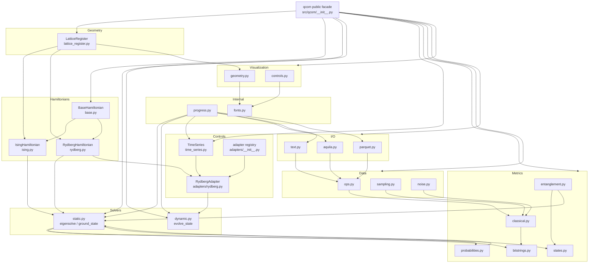
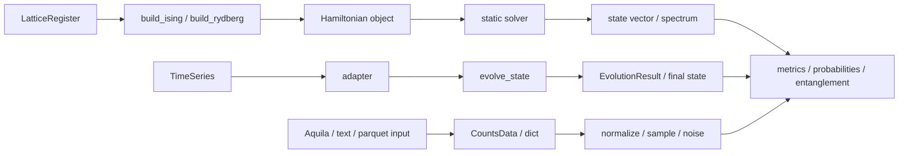

# QCOM Repository Landscape

This document is a source-grounded map of the QCOM repository.

## 1. What This Repo Is

QCOM is a small scientific Python package for quantum-systems workflows:

- define lattice geometry with `LatticeRegister`
- build Ising and Rydberg Hamiltonians
- solve static spectra or evolve states in time
- analyze classical and quantum information metrics
- read and write measurement data
- visualize geometry and control envelopes

The code is organized as a `src/`-layout library with tests, examples, and tutorial notebooks.

## 2. Top-Level Layout

- `src/qcom/`: library source code
- `tests/`: pytest suite, organized by subsystem
- `tutorials/`: notebook-based teaching path, ordered from basics to advanced workflows
- `examples/`: runnable scripts that mirror the main use cases
- `scripts/validate_tutorials.py`: notebook execution and output hygiene check
- `pyproject.toml`: build metadata, dependencies, lint/typecheck config
- `noxfile.py`: project task runner
- `pytest.ini`: pytest defaults
- `README.md`: project overview and installation guidance

## 3. Package Boundary Map

### Public facade

`src/qcom/__init__.py` is the top-level API surface. It uses lazy imports so `import qcom` stays lightweight.

It re-exports:

- geometry: `LatticeRegister`
- Hamiltonians: `build_ising`, `build_rydberg`
- solvers: `ground_state`, `find_eigenstate`
- controls: `TimeSeries`, `RydbergAdapter`
- metrics: entropy, mutual information, probability helpers
- data: normalization, truncation, sampling, noise
- I/O: text, JSON, Parquet helpers
- result containers from `core/results.py`

### Core result types

`src/qcom/core/results.py` defines the immutable containers that travel across the codebase:

- `CountsData`
- `ProbabilityData`
- `SpectrumResult`
- `EvolutionResult`
- `MutualInformationResult`

These are the canonical “typed outputs” for data, spectral, and evolution workflows.

### Geometry

`src/qcom/lattice_register.py` is the physical layout primitive.

Responsibilities:

- store site positions as explicit `(N, 3)` coordinates in meters
- preserve insertion order as the canonical site order
- expose pairwise distances
- support add/remove/clear operations
- provide plotting via `qcom.viz.geometry`

This object is the input backbone for Hamiltonian builders.

### Hamiltonians

`src/qcom/hamiltonians/` contains the physics layer.

- `base.py`: `BaseHamiltonian` abstraction
- `ising.py`: transverse-field Ising implementation
- `rydberg.py`: Rydberg/AHS-style implementation
- `__init__.py`: lazy exports and convenience builders

Architectural pattern:

- subclasses provide `num_sites`, `hilbert_dim`, and `dtype`
- subclasses implement either `_matvec` or `to_sparse`
- the base class offers `to_linear_operator`, `to_dense`, `apply`, and `ground_state`

The concrete models:

- Ising:
  - supports scalar, vector, or matrix couplings
  - mostly real-valued
  - optimized for sparse and matrix-vector use
- Rydberg:
  - takes per-site `Omega`, `Delta`, `Phi`
  - builds `C6 / r^6` interactions from `LatticeRegister`
  - can become complex when phase terms activate `sigma^y`
  - supports dense and sparse backends

### Solvers

`src/qcom/solvers/` is the numerical engine.

- `static.py`: spectral solving
- `dynamic.py`: time evolution

Static solver responsibilities:

- normalize dense, sparse, `LinearOperator`, and QCOM Hamiltonian inputs
- dispatch to Hermitian or general SciPy eigensolvers
- provide convenience helpers like `ground_state` and `find_eigenstate`

Dynamic solver responsibilities:

- accept a `TimeSeries`
- ask an adapter for `H(t)` at each step
- advance the state with `scipy.sparse.linalg.expm_multiply`
- optionally record the full trajectory

### Controls

`src/qcom/controls/` represents time-dependent drives.

- `time_series.py`: `TimeSeries` container and interpolation logic
- `adapters/base.py`: adapter protocol for time evolution
- `adapters/rydberg.py`: Rydberg-specific adapter
- `adapters/__init__.py`: registry and adapter factory lookup

Design split:

- `TimeSeries` knows only about sampled control envelopes
- adapters map envelopes to a model Hamiltonian
- the solver consumes the adapter output

### Metrics

`src/qcom/metrics/` is the analysis layer.

- `bitstrings.py`: ordering and partitioning helpers for bitstring dictionaries
- `classical.py`: Shannon entropy, reduced entropy, mutual information, conditional entropy
- `probabilities.py`: cumulative distributions, `N(p)` diagnostics, eigenstate probabilities
- `states.py`: density matrix and reduced density matrix construction
- `entanglement.py`: Von Neumann entropy from RDMs, Hamiltonians, or states

The main convention throughout metrics is:

- bitstring index 0 is the most significant bit
- all reductions and partitions preserve that convention

### Data

`src/qcom/data/` bridges raw measurement data and analysis.

- `ops.py`: normalize counts, truncate probabilities, print the most probable states
- `sampling.py`: resample distributions and merge datasets
- `noise.py`: classical readout error and optional `mthree` mitigation

This layer is intentionally simple and mostly dictionary-based.

### I/O

`src/qcom/io/` handles file formats.

- `text.py`: whitespace-delimited `bitstring value` files
- `aquila.py`: QuEra Aquila JSON parsing
- `parquet.py`: Parquet input/output through `pandas` and `pyarrow`
- `__init__.py`: lazy export boundary

The I/O modules return measurement-like dictionaries or `CountsData`.

### Visualization

`src/qcom/viz/` contains plotting helpers.

- `geometry.py`: lattice register plotting
- `controls.py`: time-series plotting

These are presentation helpers, not core computational dependencies.

### Internal helpers

`src/qcom/_internal/` is cross-cutting infrastructure.

- `progress.py`: nested-safe stdout progress reporting
- `fonts.py`: publication-style serif font selection for plots

## 4. Data Flow

### Static spectral path

1. Build a `LatticeRegister`
2. Pass it to `build_ising` or `build_rydberg`
3. Solve with `ground_state`, `find_eigenstate`, or `eigensolve`
4. Convert the state to probabilities or density matrices
5. Compute classical or quantum metrics
6. Wrap outputs in `SpectrumResult`, `CountsData`, `ProbabilityData`, or `MutualInformationResult`

### Dynamic evolution path

1. Create a `TimeSeries`
2. Create an adapter, usually `RydbergAdapter`
3. Call `evolve_state`
4. Receive the final vector or `EvolutionResult`
5. Feed the result into the same analysis pipeline as the static path

### Experimental data path

1. Read raw data with `parse_json`, `parse_file`, or `parse_parquet`
2. Normalize or resample with `data.ops` and `data.sampling`
3. Optionally inject or mitigate readout noise
4. Compute entropy, mutual information, or distribution diagnostics

## 5. Cross-Cutting Conventions

- Lazy imports at package boundaries keep import time low.
- Immutable result containers prevent accidental mutation after construction.
- `ProgressManager` is used instead of a heavy progress-bar dependency.
- Optional features are isolated behind extra dependencies:
  - `pyarrow` for Parquet
  - `mthree` for mitigation
  - `matplotlib` for visualization
- Site order and bitstring order are consistent across geometry, Hamiltonians, solvers, and metrics.
- The project favors explicit, testable, source-local helpers over hidden framework magic.

## 6. Tests And Coverage Shape

The test suite mirrors the package layout:

- `tests/test_public_facade.py`: top-level exports and lazy access
- `tests/core/`: result container validation
- `tests/hamiltonians/`: Ising and Rydberg correctness
- `tests/solvers/`: static and dynamic solver behavior
- `tests/controls/`: time-series editing, interpolation, adapter logic
- `tests/metrics/`: entropy, probability, and density-matrix routines
- `tests/data/`: normalization, sampling, and noise behavior
- `tests/io/`: text, Aquila, and Parquet round-trips

`tests/controls/test_time_series.py` is especially important because it exercises most of the mutability and interpolation edge cases.

## 7. Tutorials And Examples

Notebook order is intentionally progressive:

1. I/O basics
2. lattice registers
3. Rydberg Hamiltonians
4. static solvers
5. time series
6. dynamic solver
7. data utilities
8. metrics
9. live demo

Examples mirror the main workflows in script form, making them useful as “smallest runnable examples”.

## 8. Reading Order For New Contributors

1. `src/qcom/__init__.py`
2. `src/qcom/core/results.py`
3. `src/qcom/lattice_register.py`
4. `src/qcom/hamiltonians/base.py`
5. `src/qcom/hamiltonians/ising.py`
6. `src/qcom/hamiltonians/rydberg.py`
7. `src/qcom/solvers/static.py`
8. `src/qcom/solvers/dynamic.py`
9. `src/qcom/controls/time_series.py`
10. `src/qcom/metrics/classical.py`
11. `src/qcom/metrics/entanglement.py`

## 9. Visual Graph

### Package architecture

### Runtime flow

## 10. Important Files At A Glance

- [`/home/avi/dev/tools/QCOM/src/qcom/__init__.py`](/home/avi/dev/tools/QCOM/src/qcom/__init__.py): top-level exports
- [`/home/avi/dev/tools/QCOM/src/qcom/core/results.py`](/home/avi/dev/tools/QCOM/src/qcom/core/results.py): typed outputs
- [`/home/avi/dev/tools/QCOM/src/qcom/lattice_register.py`](/home/avi/dev/tools/QCOM/src/qcom/lattice_register.py): geometry model
- [`/home/avi/dev/tools/QCOM/src/qcom/hamiltonians/base.py`](/home/avi/dev/tools/QCOM/src/qcom/hamiltonians/base.py): Hamiltonian abstraction
- [`/home/avi/dev/tools/QCOM/src/qcom/solvers/static.py`](/home/avi/dev/tools/QCOM/src/qcom/solvers/static.py): spectral solver
- [`/home/avi/dev/tools/QCOM/src/qcom/solvers/dynamic.py`](/home/avi/dev/tools/QCOM/src/qcom/solvers/dynamic.py): time evolution
- [`/home/avi/dev/tools/QCOM/src/qcom/controls/time_series.py`](/home/avi/dev/tools/QCOM/src/qcom/controls/time_series.py): control envelopes
- [`/home/avi/dev/tools/QCOM/src/qcom/metrics/classical.py`](/home/avi/dev/tools/QCOM/src/qcom/metrics/classical.py): classical entropy measures
- [`/home/avi/dev/tools/QCOM/src/qcom/metrics/entanglement.py`](/home/avi/dev/tools/QCOM/src/qcom/metrics/entanglement.py): Von Neumann entropy
- [`/home/avi/dev/tools/QCOM/scripts/validate_tutorials.py`](/home/avi/dev/tools/QCOM/scripts/validate_tutorials.py): notebook execution validation

